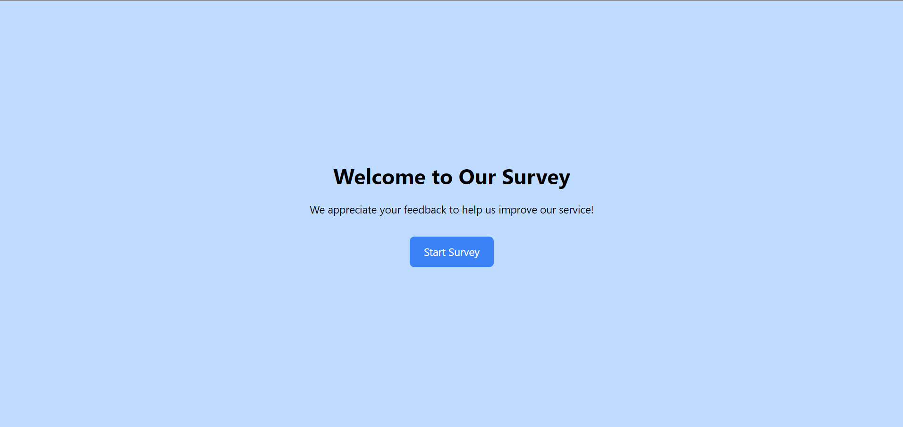

# Customer Satisfaction Survey Kiosk

This is a responsive survey application built using **React.js** with **Tailwind CSS** for styling and **Redux** for state management. The application is intended for use in a kiosk within a shop to collect customer feedback.

## Live URL 
- [https://code-inbound-assignment.vercel.app/]

## Table of Contents
- [Features](#Features)
- [Technologies Used](#Technologies-Used)
- [Screenshots](#Screenshots)
- [Styling](#Stying)
- [Installation](#installation)
- [Folder Structure](#folder-structure)

## Features

- A welcome screen to greet customers.
- A series of 5 survey questions with different input types:
  1. Rating (1-5) for product satisfaction.
  2. Rating (1-5) for price fairness.
  3. Rating (1-5) for value-for-money satisfaction.
  4. Rating (1-10) for likelihood of recommending the shop.
  5. Text input for suggestions on improving the service.
- User can navigate back and forth between questions and skip any question.
- Answers are stored locally using **localStorage**.
- Upon survey completion, users are prompted to submit their responses.
- After submission, a confirmation screen thanks the user, followed by a redirection back to the welcome screen.

## Technologies Used

- **React.js**: For building the frontend user interface.
- **Tailwind CSS**: For responsive and modern styling.
- **Redux**: For state management.
- **localStorage**: For persisting survey responses.

## Styling
- For the styling Tailwind Css is used

## Screenshots




## Installation and Setup

Follow these instructions to get a copy of the project up and running on your local machine.

### Prerequisites

- **Node.js**: Ensure you have Node.js installed. You can download it [here](https://nodejs.org/).

### Steps to run the project locally

1. **Clone the repository:**

   ```bash
   git clone https://github.com/abhishek-2k23/code-inbound-assignmenet.git


## Folder Structure
src/
│
├── components/
│   ├── WelcomeScreen.js
│   ├── SurveyScreen.js
│   └── ThankYouScreen.js
│
├── redux/
│   ├── store.js
│   └── surveySlice.js
│
├── data/
│   └── questions.js
│
└── App.js
